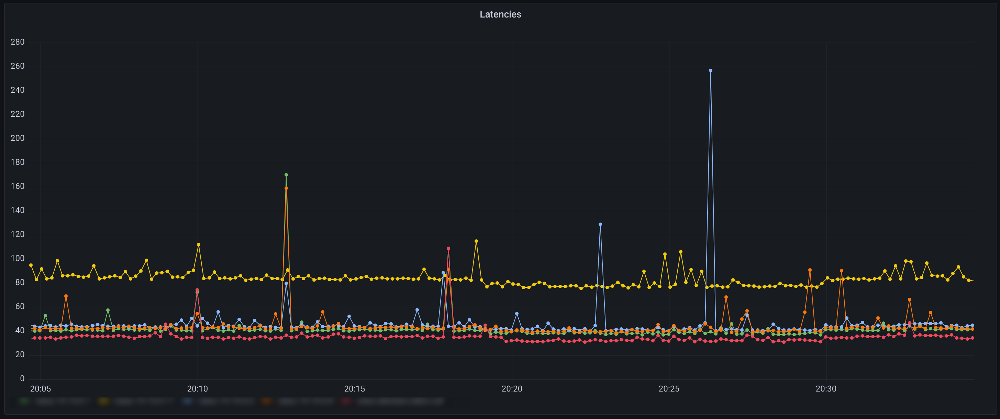

# Simple Reaction Daemon

This program allows to monitor hosts and define actions that will be executed if a ping to some host fail (or succeed). Currently implemented actions are:

* [restart another systemd-service](#action-restart-a-service) (f.ex: systemd-networkd, iwd or wpa_supplicant)
* [log to a file](#action-log-to-a-file)
* [restart the system](#action-reboot)
* [write data to an InfluxDB instance](#action-write-to-influxdb)
    * [Here is an example visualization](#use-case---latency-logging)
* [execute custom command as user](#action---execute-arbitrary-command-as-a-user)
    * f.ex: Send wake-on-lan packet to host, send an email, ...


It can be installed as a systemd service to run in the background (see Installation).
Do not forget to enable and start (`systemctl enable srd`, `systemctl start srd` respectively) the service.

The motivation for this service is to log disconnects (or the time an IP is reachable) and have some actions in place which may bring the device back online or act as a dead man's switch.

<br />

# Building

After cloning this repository simply run `make` in the root folder of the project.

You need glibc, libconfig and headers for systemd.

*On Debian*: `libconfig-dev libsystemd-dev`

*On Arch*: `libconfig systemd`

<br />

# Installation

There are two available installation methods:

* ## Installation - ArchLinux
    * AUR: `[paru|yay|your-favourite-aur-helper] simple-reaction-daemon` 
    * Manual: <br />
    Enter the folder `arch-pkg` and run `makepkg` and then you can install the packaged \*.tar.zst file (or simply run `makepkg -si`).

* ## Installation - Manual

    Build with `make` and copy/install srd binary to custom location.

<br />

# Configuration

The service is configured by so called **target files** in `/etc/srd/NAME.conf` (with arbitrary name) which follow the following format:
They can be dependent on eachother by configuring `depends`. If a dependency is unreachable then the current target won't be checked and no action *for this target* will be taken.

```
# destination IP
destination = "127.0.0.1[,192.168.0.5]"

# Period of the pings in s
period = 60

# timeout for one ping in s
timeout = 10

# number of pings to send
num_pings = 1

# available loglevels: DEBUG, INFO, QUIET, ERROR
loglevel = "INFO"

actions = (
    {
        action = "reboot";
        # delay in seconds
        delay = 1800; # 1/2 hour
    },
    {
        action = "service-restart";
        name = "systemd-networkd.service";
        delay = 60; # 1 minutes
    }
)

```

`destination`: IP or domain to ping regularly
    
* Can also be `%gw` to ping the gateway
    * **Note**: this is currently only set at startup. So changes of the gateway are not yet supported

<br />

`period`: Delay between the pings in seconds. Must be an integer.

<br />

`timeout`: Time to wait for a ping response in seconds. Must be an integer.

<br />

[optional] `num_pings`: Amount of sequential pings sent. Defaults to 1. This should be used if `period` is large. If one of the pings succeeds we deem the host as UP.

[optional] `depends`: IP of another target (must be its own target). If the ping to depends is not successful, then this target won't get checked and no actions performed.

* Can also be `%gw` to ping the gateway
* **Note**: this is currently only set at startup. So changes of the gateway are not yet supported

[optional] `loglevel`: Loglevel for the current target. Can be: DEBUG, INFO (logs when an action is executed and when a ping fails), QUIET, ERROR

<br />

## srd.conf
This file's loglevel is also the loglevel for the application

Also `datetime_format` is configurable, by default it's:
```
datetime_format = "%Y-%m-%d %H:%M:%S"
```
See here for the exact format: [https://cplusplus.com/reference/ctime/strftime/](https://cplusplus.com/reference/ctime/strftime/)
* **Addition**: `%%ms` (really double percentage sign) is replaced with the milliseconds of the current time 

<br />

## Actions
**Note**: The `delay` configuration denotes the amount of time passed (in seconds) since the last successful ping (at least `period + num_pings * timeout` seconds) until this action is performed. `num_pings` is how many pings are sent in sequential order (only one has to succeed) and worst case takes `num_pings * timeout` time. This makes sense if you have a high period but you don't want to have a host labeled as 'down' if a ping gets lost.

### Action **reboot**:

* Reboots the current machine.
```
{
    action = "reboot";
    delay = 3600; # 1 hour
}
```

* User running `srd` needs permissions to send dbus commands

### Action **restart a service**:

* Restarts the given systemd service.
```
{
    action = "service-restart";
    name = "systemd-networkd.service";
    delay = 600; # 10 minutes
}
```
* User running `srd` needs permissions to send dbus commands


### Action **log to a file**:
```
{
    action = "log";
    message = "Host %ip was down from %sdt until %now";
    path = "SOME_PATH/downtimes.log";
    user = "REPLACEME";
}
```

* With `user` you can define the owner of the file
    * This is only set when creating the file
* Additional setting `header` takes a string which will be the header if the file is newly created:
    * For example: ``` header = "host, latency";``` would be suitable for CSV files
        * And corresponding ``` message = "%ip, %lat_ms";```
    * **Note for strings:** You can use `\n` as a line-break and create multi-line headers ;)
* Notes for `path`: Supports the [placeholder](#placeholders) `%ip`
* Notes for `message`:
    * Supports [placeholders](#placeholders)

### Action **write to InfluxDB**:
```
{
    action = "influx";
    host = "IP or hostname";
    port = 8086;
    endpoint = "/api/v2/write&bucket=YOUR_BUCKET&org=YOUR_ORG&precision=s";
    authorization = "Token XYZ";
    linedata = "latency,host=%ip, value=%lat_ms %timestamp";
    run_if = "always";
}
```
* Notes for `linedata`:
    * Supports [placeholders](#placeholders)
* Notes for `endpoint`:
    * Supports `%ip` placeholder

### Action - **execute arbitrary command as a user**:

If a host is **down**:
```
{
    action = "command";
    delay = 10;
    user = "REPLACE-ME";
    cmd = "notify-send \"DOWN at %now\"";
}
```
Or if he's **up**:
```
{
    action = "command";
    run_if = "up";
    user = "REPLACE-ME";
    cmd = "notify-send \"UP at %now\"";
}
```
* Notes for `cmd`:
    * For placeholders see [here](#placeholders)
* You can also set `timeout` to terminate the command after `timeout` seconds if it has not finished yet.
    * The default `timeout` is one day

<br />

### Conditional actions - run_if
Valid values for `run_if`:
* `up` - Run everytime a ping succeeds (approximately every `period` seconds)
* `up-new` - Runs **once** when a ping is successfull after the target has been down for at least `command.delay` seconds (defaults to 0)
* `down` (default)
    * If `command.delay` seconds no ping succeeds this target is seen as down and this action executed
* `down-new` Executes **once** if a target was reachable before and now isn't
* `always`

### Placeholders
Currently supported by `command.cmd` and `log.message`:

Always available:
* `%ip` is the actual IP of the current target
* `%status` is `success` or `failed` depending on the result of the ping
* `%now` is the current time formatted like `datetime_format` defined in srd.conf (See [here](#srdconf))
    * `%timestamp` is the unix timestamp (seconds since 01.01.1970)
* `%lat_ms` is the latency (in milliseconds) of the ping. It's `-1.0` if the ping failed or timed out

<br />

The supported placeholders depend on `run_if`:
* `%uptime` for the uptime in days, hours, minutes and seconds
    * available for run_if = `up`, `up-new`, `down-new` (duration between first successfull ping and latest succesfull ping)
* `%downtime` for the downtime in days, hours, minutes and seconds
    * available for run_if = `down`, `down-new`, `up-new`
* `%sdt` (**s**tart **d**own**t**ime) is the timestamp (in `datetime_format` format defined in [srd.conf](#srdconf)) from the first ping that failed
    * available for run_if = `down`, `down-new`, `up-new` 
* `%sut` (**s**tart **u**p**t**ime) is the timestamp (in `datetime_format` format defined in [srd.conf](#srdconf)) from the first ping that **succeeded**
    * available for run_if = `up`

<br />

# Use case - wireguard VPN

If you have a wireguard VPN with a DNS entry but dynamic IP it'll disconnect if the IP of the server changes. 

Using srd you can mitigate this with the following *target file*:


```
# destination IP; This is the IP of the VPN server
destination = "10.10.0.1"

# Period of the pings in s
period = 60

# timeout for one ping in s
timeout = 10

actions = (
    {
        action = "service-restart";
        name = "wg-quick@wg0.service";
        delay = 300; # 5 minutes
    },
    {
        action = "service-restart";
        name = "systemd-networkd.service";
        delay = 1800; # 30 minutes
    }
)
```

# Use case - monitoring of the clients inside a VPN

In this scenario you have some clients which must be online all the time and you want to monitor their reachability.
You also could define a command to send an email to you, etc.

```
# destination IP; This is the IP of the VPN server
destination = "10.10.0.1,10.10.0.2,10.0.0.3[,10.10.0.X,...]"

# Period of the pings in s
period = 60

# timeout for one ping in s
timeout = 10

# uncomment, if you also have your gateway as a target
# depends = "%gw"

actions = ( 
    {   
        action = "log";
        delay = 60;
        path = "PATH/vpn_clients_pings.log";
        message = "%now: ip failed ping. Now for %downtime (Since %sdt).";
    }
)

```

Here's the file to check the gateway. This is used to not check the vpn clients if the gateway is unreachable (and unnecessarily log that they are down).

```
# destination IP
destination = "%gw"

# Period of the pings in s
period = 30

# timeout in seconds of one ping
timeout = 5

actions = (
    {
        action = "command";
        delay = 10;
        user = "david";
        cmd = "notify-send \"gateway %ip is down\"";
    }
)
```

# Use case - Latency logging

By logging into an influx database we can visualize the latencies to various hosts over time:




```
# destination IP
destination = "10.10.0.1,[Some more hosts]"

# Period of the pings in s
period = 10

# timeout for one ping in s
timeout = 2

# Only execute if gateway is actually available
depends = "%gw"

num_pings = 2

actions = (
    {
        action = "influx";
        host = "INFLUX_HOST";
        port = 8086;
        endpoint = "/api/v2/write&bucket=YOUR_BUCKET&org=YOUR_ORG&precision=s";
        authorization = "Token XYZ";
        linedata = "latency,host=%ip, value=%lat_ms %timestamp";
        run_if = "always";
    }
)
```
